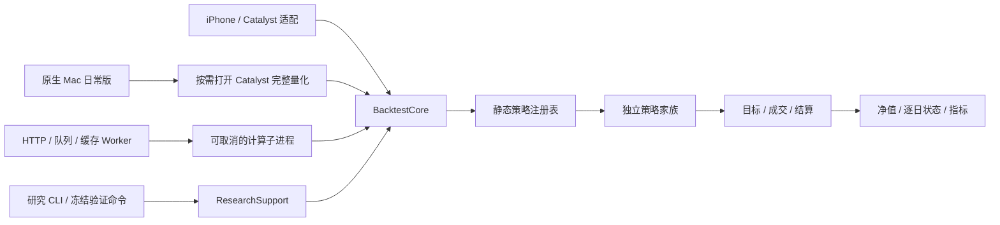

# 策略、回测与研究模块

本次迁移固定策略规则与 settlement-v4 执行口径。目录顺序、推荐项、公开五项、NFCI 前瞻名单、账户同步协议及旧回测记录 JSON 均保持。



## 代码归属

- `Sources/AssetTimeMachineBacktestCore/Domain`：Foundation 值类型、报告、历史输入、持仓映射输入、记录编码协议与不可变参数。无 SwiftUI、SwiftData 或主题依赖。
- `MarketData`：日期对齐、真实报价与估值填充、FX、OHLC、可用区间。
- `Strategies`：现金置信度、风险贡献、NFCI、金纳双趋势、近期窗口及其他策略家族。通用轮动配置在 `Strategies/Rotation`；静态工厂在 `StrategyRuntimeRegistry`。
- `Execution`：成交结算与账务；`BacktestCoreEngine` 保留兼容调用名，转发至对应归属模块。
- `Metrics`：原公式、收益与风险、连续回放后的区间报告。
- `API/BacktestRun.swift`：`StrategyReference`、`StrategyDefinition`、每次独立 runner、配置、输入、输出及运行来源。72 个定义覆盖原 41 个模板与未在模板中出现的兼容模式，产品 UI 不展示新增兼容项。
- `Sources/AssetTimeMachineResearchSupport`：配置文件解析、SHA-256 证据、指标命令、成本验证及正式冻结工具。
- `ResearchSupport/Legacy`：`asset-agnostic-legacy-d801a9bb` 历史模拟器；新公开计算仍使用 settlement-v4。
- `AssetTimeMachine/Backtest`：UI、颜色、文案与图表；`BacktestEngine` 是薄转发，`BacktestRecordAdapter` 映射真实 SwiftData 记录。
- `Server/Sources/Worker`：授权、输入、数据抓取、队列、缓存、超时和子进程。计算使用共享库，不拼接 App 源码。

## 参数、数据和来源

正式策略读取有类型冻结配置。研究参数是不可变的 `BacktestResearchParameters`；作用域通过 `@TaskLocal` 传入嵌套决策模拟，每次运行的现金、持仓、领导力和宏观输入仍为独立值。当前维护的源码不再含 `BacktestResearchOverrides` 可变全局变量，也不再查询宏观数据单例。

注册表维护 ID、规则版本、数据要求和新状态工厂。既有 NFCI 冻结版本原样保留；其余尚无正式规则版本的实现标记 `rules-d801a9bb`，该版本指向迁移前规则源，不代表验证通过。冻结参数 JSON 包含原模板规则、风险设置、轮动组件、研究默认参数、金纳参数、现金置信度参数及 NFCI/风险贡献组合参数；其编码结果为不可变缓存。

成本单位保持 **百分数**。当前 settlement-v4 公开策略手续费为 **0.025%**、滑点 **0.05%**；近期窗口模式自身的默认滑点仍为零。低噪及 NFCI 的内部决策模拟仍使用冻结 **1.00% / 0.05%**。内部成本和最终成交成本分别记录。历史 1% 工件保持原样。

`BacktestRunInput` 显式传入行情、真实观察掩码、FX 序列和 NFCI as-of 快照。未传掩码表示原始行均为实际报价；传入 `false` 的估值填充行不会作为成交报价。缺少所需数据、版本错误、无效配置、空评估区间和取消均返回错误。新接口在完整状态回放后截取区间，现金、持仓和净值一起缩放。规则策略也输出逐日状态，其中 `targetWeights` 表示规则执行后的实际仓位占比。

新保存的 App 高级回测记录在原配置 JSON 中增加可选 `runtimeProvenance`，保存所选注册策略版本、执行版本及冻结参数/哈希。自定义规则不伪造注册策略身份；缺失的数据哈希与源提交保留未知。旧记录仍能读取，重新编码不会添加不存在的来源；同步端继续透传原配置 JSON。

App 今日建议与历史回测使用相同策略工厂。建议缓存包含行情、宏观、参数、规则版本和执行版本；失效时取消旧任务，并禁止旧任务重新填回缓存。Worker 缓存包含执行版本、规则版本、冻结参数、数据哈希与完整规范化请求。

## 研究命令

```bash
swift run -c release AssetTimeMachineResearch catalog
swift run -c release AssetTimeMachineResearch configuration \
  --strategy risk-contribution-cash-confidence-low-noise > /tmp/run.json
swift run -c release AssetTimeMachineResearch run \
  --config /tmp/run.json --history /path/history.json \
  --macro /path/nfci-asof.json --output /path/new-evidence \
  --source-commit FULL_SOURCE_COMMIT
```

配置必须含 `schemaVersion` 与完整 `run` 对象；拼错的字段、缺失对象或非法参数会在计算前失败。正式策略拒绝研究覆盖。研究配置不进入公网 HTTP。

可选 `--observations FILE` 读取 `{symbol: [Bool]}`。未提供掩码时数据哈希为历史文件 SHA-256；提供时为 `SHA256(historySHA256 + "|" + masksSHA256)`，保证掩码影响缓存/证据。

输出目录必须是新目录，包含 `evidence.json`、`parameters.json`、`result.json`。证据记录完整配置与冻结参数、参数哈希、数据/宏观哈希、规则与执行版本、源提交、成本和区间。未提供历史来源时明确为 `unknown`。该命令是工程回放，不产生策略准入或验证状态变更。

现有维护命令：

- `AssetTimeMachineMetricDump`：原 CSV、基线核对和近期窗口导出；要求显式 fixture。
- `AssetTimeMachineExecutionReassessment` / `scripts/replay_execution_reassessment.py`：固定输入逐日重放。
- `AssetTimeMachineResearch verify-cost-invariance` / `scripts/verify_low_noise_cost_invariance.py`：冻结目标路径的成本核对。
- RSRangeBreadth/Intraday 的四个正式命令：引用 ResearchSupport；原协议和保护条件继续生效。

工程逐日对照可通过 `ATM_REPLAY_STRATEGIES` 为 `AssetTimeMachineExecutionReassessment` 指定逗号分隔的注册策略 ID，例如每批 6 项。未指定时保持完整原清单；未知、重复或空选择在计算前失败。分批只限制输出的策略集合，每项策略仍完整回放，适合内存较小的验证宿主。它不改变公网接口或研究参数。

历史搜索命令及旧源码分片通过记录的原 Git 版本运行：

```bash
python3 scripts/replay_legacy_research.py \
  --source-ref RECORDED_SOURCE_COMMIT \
  --entrypoint scripts/run_v11_execution_cost_stress.py -- ORIGINAL_ARGUMENTS
```

兼容脚本也接受 `--legacy-ref RECORDED_SOURCE_COMMIT`。临时独立 checkout 保留真实 Git 身份，不修改当前工作区；原历史工具继续执行原逻辑。没有原版本信息时拒绝运行，禁止将旧实验默认为当前 settlement-v4 新实验。

## 验证和发布

```bash
swift test -c release
python3 scripts/compare_backtest_replays.py BEFORE.json AFTER.json --output NEW_REPORT.json
```

对照命令核对完整日期、目标、现金、持仓、净值、逐笔交易顺序与指标。金额容差 `max(1e-8, abs(before) * 1e-12)`，目标和指标绝对误差 `1e-12`。逐日比较使用固定 Swift 哈希种子，以控制迁移前既有集合遍历产生的浮点尾差；生产计算顺序没有被改动。

Python 的授权名单通过 `backend/tests/test_backtest_strategy_registry.py` 核对编译后注册表；`ATM_SWIFT_REGISTRY_JSON` 可指定最新导出。`scripts/verify_backend_strategy_contract.py --backend-checkout PATH --python PYTHON` 自动从当前 Package 导出并运行相关仓库的离线契约；fixture 支持独立后端回归。

Docker 打包共享 Package、锁文件及资源 bundle。计算继续在独立子进程运行；取消、排队取消、超时及 Worker 关闭均清理计算进程和临时文件。发布必须先通过独立 Worker 对照，再以完整 Git SHA 镜像切换并清理旧结果缓存；原冻结计算二进制和上一生产镜像保留。内存、跨平台和 canary 结果见同目录迁移报告。TestFlight 单独安排。
