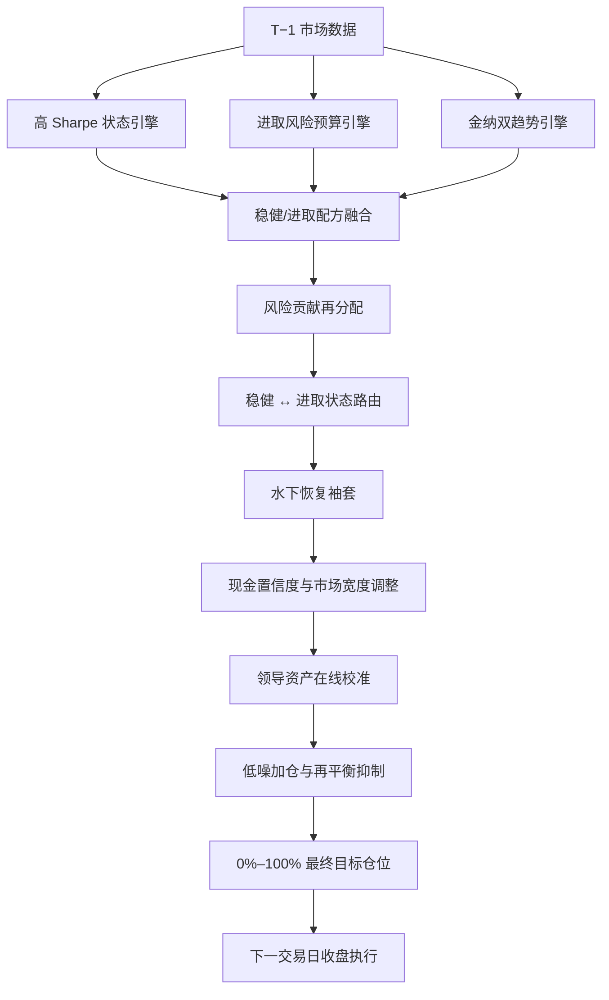

# 低噪增强策略：生产逻辑说明

> 文档状态：与 2026-08-13 的 App 生产回测引擎一致
> 策略 ID：`risk-contribution-cash-confidence-low-noise`
> App 显示名：`低噪增强`
> 历史基准中的旧显示名：`无杠杆低噪增强`

## 1. 结论先行

`低噪增强`不是“选择近期涨得最好的一个资产”这么简单，也不是单一均线策略。它是一套分层的目标仓位系统：

1. 先由三套相互独立的底层引擎分别给出黄金、美股、A 股和现金的目标仓位。
2. 将三套目标按稳健/进取配方融合，并根据波动、相关性和风险贡献重新分配。
3. 根据稳健引擎与进取引擎的长期相对表现切换状态。
4. 当组合长时间处于回撤、而美股趋势重新确认时，从闲置现金中增加有限的恢复仓位。
5. 用市场宽度、组合回撤和当前主导资产继续调整总仓位。
6. 对“领导资产切换”做只使用历史结果的在线可信度校准，避免一次性全仓追随新领导资产。
7. 最后由低噪执行层抑制同一主导资产下的小幅再平衡，并把总风险资产仓位严格限制在 100% 以内。

它的产品定位可以概括为：

> 在黄金、纳指、标普 500、沪深 300、上证综指之间动态配置；允许大量持有人民币活期现金，但不允许融资、不允许负现金，通过多引擎共识和低换手执行提高收益/回撤比。

## 2. 为什么它是“当前最优”

这里的“最优”有明确边界：它指当前 App 精选策略中，在固定历史数据、固定成本假设和当前指标体系下综合表现最好，不代表未来一定最优。

固定基准快照下，精选策略的完整历史表现如下：

| 策略 | 年化收益 | 最大回撤 | Sharpe |
|---|---:|---:|---:|
| 低噪增强 | 14.44% | 7.93% | 1.508 |
| 进取配置 | 10.55% | 14.09% | 1.020 |
| 均衡配置 | 9.63% | 13.02% | 1.010 |
| 金纳双趋势 | 10.20% | 16.93% | 0.904 |
| 防守配置 | 8.58% | 11.67% | 0.992 |

`低噪增强`同时具备精选策略中最高的完整历史年化收益、最低的最大回撤和最高的 Sharpe，因此被设为当前推荐策略。

这些数字来自 App 生产 Swift 引擎，不是另一套研究脚本的近似结果。基准条件为：

- 初始资金：100,000 元人民币；
- 单边交易费：1.00%；
- 单边滑点：0.05%；
- Sharpe：按日收益年化，零无风险利率假设；
- 历史快照：2002-02-04 至 2026-08-07；
- 美股指数按历史汇率换算成人民币；
- 权益行情为价格变化序列，不额外注入股息再投资。

## 3. 资产范围

策略只使用以下五个风险资产序列：

| 资产组 | 内部标识 | 作用 |
|---|---|---|
| 人民币黄金 | `gold_cny` | 防守、分散、趋势主仓 |
| 纳斯达克综合指数 | `nasdaq` | 成长型美股风险资产 |
| 标普 500 | `sp500` | 广谱美股风险资产 |
| 沪深 300 | `csi300` | 中国大盘权益 |
| 上证综指 | `shanghai_composite` | 中国市场宽度与权益配置 |

未分配给上述资产的资金全部视为人民币活期现金。现金按引擎内置的历史人民币活期存款基准利率逐日计息。

策略不使用：

- 比特币；
- 外部基金或不可在 App 中表达的代理资产；
- 期货空头、合成反向仓位；
- 融资或负现金；
- 期限存款、货币基金、逆回购等现金增强工具。

## 4. 总体架构



重要理解：上游某一层临时允许超过 100% 的研究目标，并不代表产品最终会融资。最外层会再次压缩目标，生产策略最终总风险资产仓位不超过 100%，执行器也不允许现金降到零以下。

## 5. 第一层：三套底层引擎

### 5.1 高 Sharpe 状态引擎

该引擎以黄金和权益状态为核心，偏向在风险收益效率较好时持仓，在自身收益走弱或回撤扩大时收缩风险预算。它提供“质量和防守状态”视角。

### 5.2 进取风险预算引擎

该引擎比较黄金防守结构与权益宽度结构，在进攻引擎更强时增加风险预算，但仍保留防守组合。它提供“风险预算和市场宽度”视角。

### 5.3 金纳双趋势引擎

黄金和纳指分别判断自身长期趋势；各自趋势有效时持有，对应趋势失效时转回现金。它不是在黄金与纳指之间二选一，而是两个相对独立的趋势袖套。

三者的意义在于避免最终策略只依赖一种信号。某一引擎可以偏防守，另一引擎可以保持进攻，最终由后续层决定是否放大共识、压低分歧。

## 6. 第二层：风险贡献再分配

### 6.1 两套配方

系统同时维护稳健配方与进取配方。

| 配方 | 高 Sharpe 引擎 | 风险预算引擎 | 金纳双趋势 |
|---|---:|---:|---:|
| 稳健 | 40% | 25% | 35% |
| 进取 | 35% | 30% | 35% |

先按以上比例融合三套目标仓位，再根据底层共识调整总仓位：

- 融合后总仓位不低于 75%，且每套底层引擎至少有 20% 风险仓位：稳健配方乘 1.40，进取配方乘 1.60；
- 融合后总仓位不低于 30%：稳健配方乘 1.20，进取配方乘 1.30；
- 低于 30%：不放大。

这一步表达的是“共识越强，风险预算越高”。

### 6.2 风险贡献检查

当底层目标变化或距离上次检查达到 42 个交易日时，系统使用最多 126 个交易日的收益计算：

- 每个资产的年化波动；
- 资产之间的协方差和正相关程度；
- 每个资产对组合方差的边际风险贡献。

如果单一资产的组合风险贡献超过 65%，系统会把目标向低波动、与其他资产正相关程度较低的资产重新分配：

- 稳健配方：60% 采用风险平衡结果，40% 保留原目标；
- 进取配方：100% 采用风险平衡结果；
- 稳健配方波动惩罚指数为 1.40，进取配方为 2.00；
- 稳健配方相关性惩罚为 1.75，进取配方为 3.00。

因此“目标权重最大”不一定等于“风险贡献最大”；高波动、高相关资产可能被主动降权。

### 6.3 两个 T−1 追涨刹车

底层风险贡献引擎包含两个只影响加仓、不延迟减仓的保护：

1. **美股跳升刹车**：原美股仓位至少 10%，新目标一次增加超过 10%且不超过 20%，同时纳指和标普 500 的 5 日动量均不为正时，只执行该增量的 60%。
2. **中美切换刹车**：A 股目标一次下降至少 15%，同时美股拟增加 5%–10%，而纳指或标普 500 的 5 日动量尚未转正时，恢复链使用的配方只放行该美股增量的 26%。

它们防止刚离开一个区域市场，就把风险立即完整转移到尚未确认的另一区域市场。

## 7. 第三层：稳健/进取状态路由

系统分别模拟上一层的稳健组合和进取组合，再决定当前使用哪一套。

### 7.1 慢状态切换

- 比较窗口：252 个交易日；
- 检查频率：每 63 个交易日；
- 进入进取状态：进取组合过去 252 日相对稳健组合领先至少 2.5%，且进取组合净值不低于自身 63 日均值；
- 退出进取状态：相对表现落后至少 3%，或进取组合净值跌破其 63 日均值的 97%。

进入进取状态后，如果进取组合近 28 日收益为正、近 28 日回撤不超过 1.5%，并且纳指或标普 500 同时满足“站上 MA120、60 日动量为正”，`低噪增强`会把进取目标乘 1.05。

### 7.2 快速桥接

慢状态每 63 日才检查一次，可能错过突然恢复。因此系统在稳健状态下设置一条短期桥接通道：

- 四个权益指数中至少三个 10 日上涨；
- 至少三个站上 MA20；
- 纳指或标普 500 的 10 日涨幅至少 2.5%；
- 进取组合近 10 日收益至少 2%；
- 进取组合近 10 日回撤不超过 2%。

条件满足后，将 15% 的进取目标混入稳健目标，最长保持 12 个交易日；两大美股指数 3 日跌幅同时达到 −1.5% 或持有期结束时退出，退出后冷却 30 个交易日。

## 8. 第四层：水下恢复袖套

这层只在组合经历较长回撤、但美股趋势已经恢复时使用闲置现金加仓，不是常态杠杆。

### 8.1 启动条件

必须同时满足：

- 基础组合离前高至少 60 个交易日；
- 基础组合回撤至少 5%；
- 纳指或标普 500 至少一个站上 MA100，且 60 日动量为正；
- 距离上次恢复退出至少 150 个交易日；
- 同一回撤阶段最多进入两次。

### 8.2 恢复仓位大小

恢复袖套的理论上限为 20.75%，但实际仓位还受以下三者的最小值约束：

- 可用现金扣除 5% 现金储备；
- 中间组合距离 120% 研究上限的空间；
- 恢复袖套自身上限。

当基础组合近 60 日年化波动达到 6%时，袖套上限进一步降至 19%。最终产品层仍会把总仓位压回 100%，因此这些中间上限不代表真实融资。

### 8.3 纳指与标普的分配

只对满足“站上 MA100 且 60 日动量为正”的美股指数分配。质量分数综合：

- 95 日正动量；
- 95 日趋势效率，即净涨幅相对路径波动的比例；
- 40 日总波动；
- 40 日下行波动，权重占波动估计的 75%。

两个指数质量差距较小时使用 4 次方强化，差距达到 3.5% 后使用 12 次方强化，让明显更优的资产获得更集中仓位。

恢复仓位每 60 个交易日复核。至少持有 10 个交易日后，如果两大指数趋势均失效，或两者 3 日跌幅都不高于 −5%，立即退出。

## 9. 第五层：现金置信度与市场状态调整

水下恢复层生成基础目标后，最外层先根据基础总仓位确定初始尺度：

| 基础总仓位 | 初始尺度 |
|---|---:|
| 小于 20% | 0，即转为现金 |
| 20%–60% | 1.00 |
| 60%–80% | 0.65 |
| 不低于 80% | 1.00 |

随后叠加市场宽度和组合状态：

- 四个权益指数的 20 日动量中恰好只有一个为正：再乘 0.70；
- 四个权益指数中恰好三个 10 日动量为正、基础总仓位不低于 80%、基础组合 60 日年化波动低于 8%：乘 1.30；
- 基础仓位低于 100%，且基础组合处于 2.5%–5.1% 回撤：乘 0.60。

这里故意不是“仓位越高越继续放大”的线性关系。60%–80% 被视为置信度尴尬区，先主动降档；真正形成高共识后才恢复完整尺度。

## 10. 第六层：专项防守规则

### 10.1 低置信度 A 股清理

调整后总仓位在 20%–50%之间、A 股至少占 5%，且 A 股为最大资产组时，沪深 300 和上证综指目标会被清零。其含义是：低总置信度状态下，不保留由弱信号产生的 A 股主导仓位。

### 10.2 窄区间状态清理

- 黄金主导且总仓位在 30%–40%：全部目标再乘 0.45；
- 纳指主导且总仓位在 50%–60%：目标清零；
- 小于 3% 的残余仓位直接清零。

这些规则用于删除历史上风险收益比较差的“半信半疑”状态，而不是对某个资产做永久看空判断。

### 10.3 小变化保持原仓位

以下状态会优先维持上一目标，减少无意义换手：

- 黄金主导且新总仓位在 10%–18%；
- 纳指主导且新总仓位在 18%–23%；
- 权益市场在 5、6、7、9、10 日中的任一观察窗恰好只有一个指数上涨；
- 新总仓位在 5%–6%。

### 10.4 A 股退出哨兵

如果上一目标至少 40% 且由 A 股主导，新基础目标突然降至 5%以下，同时基础组合仍距高点不足 2%、近 60 日波动处于 6%–8%，策略不完全清仓，而是按原沪深 300/上证比例保留最多 5% 的 A 股哨兵仓位。

## 11. 第七层：领导资产在线可信度

系统把目标分为五种领导状态：黄金、纳指、标普 500、A 股和现金。

当基础目标发生领导资产切换，且新目标不是减仓状态时，策略不会默认一次性全部迁移，而是按历史成功率决定本次迁移比例。

### 11.1 在线学习方法

- 每次领导资产切换后观察 10 个交易日；
- 比较新领导资产和旧领导资产在这 10 日内的收益；
- 对每类新领导资产分别累计成功与失败；
- 使用 Beta(2,2) 先验，避免样本很少时过度自信。

后验均值为：

```text
(2 + 成功次数) / (4 + 成功次数 + 失败次数)
```

迁移比例为：

```text
50% + 50% × max(2 × 后验均值 − 1, 0)
```

因此：

- 缺少历史证据时至少执行 50%；
- 新领导资产历史切换表现越可靠，越接近 100%迁移；
- 减仓、退出风险资产和转现金不受该慢迁移约束。

该学习严格使用当时已经发生的 10 日结果，不读取未来数据。

## 12. 第八层：低噪增强与最终仓位

### 12.1 近高点减仓缓冲

当新目标总仓位比上一目标下降超过 2%，基础组合距 252 日高点回撤不足 4%时，策略执行大部分减仓，但保留一小部分原领导资产：

- 默认执行减仓的 80%；
- 保留量随总仓位下降幅度和换手严重度增加；
- 保留比例最高不超过拟减仓量的 25%；
- 总换手达到 40%时，按各资产实际卖出比例分配缓冲。

这不是延迟风险退出。真正的大回撤或风险状态已经恶化时，上述“近高点”条件不成立，减仓仍正常执行。

### 12.2 平静趋势中的有限加仓

当目标主导资产不是黄金、总仓位至少 20%但未满仓，并同时满足：

- 纳指和标普 500 都站上 MA200；
- 两者 126 日动量都为正；
- 基础组合距 252 日高点回撤不超过 3%；
- 当前目标组合 63 日预测波动低于 9%；
- 20 日短波动不高于 63 日波动；

策略会以 9%目标波动为参照增加风险仓位，单次放大不超过 1.15 倍，也不突破 100%。纳指主导时，新增仓位优先给纳指；其他状态按原比例放大。

### 12.3 主动收益尺度

上述处理后还会应用一个主动收益尺度：

- A 股主导：乘 1.30；
- 其他主导状态：乘 1.22；
- 纳指或标普主导，63 日动量为正且 20 日波动不高于 63 日波动：乘 1.24。

放大后再次统一压缩，确保总风险资产目标不超过 100%。因此它改变的是现金与风险资产之间的比例，不产生融资仓位。

### 12.4 动态低换手规则

如果新旧目标的领导资产相同、不是现金，且总仓位变化不超过 2%，系统会按当前组合 60 日波动设置更宽的免调仓区：

| 组合年化波动 | 小于该总权重差则不调仓 |
|---|---:|
| 低于 6% | 20% |
| 6%–8% | 30% |
| 不低于 8% | 50% |

黄金主导且组合波动达到 12%时会解除最宽的迟滞，允许更快修正黄金仓位。

除此之外，策略层的总权重变化门槛为 24.4%。执行器对单资产也使用 24.4%的相对偏离带：只有当前市值明显高于或低于目标市值，才真正卖出或买入。

这就是“低噪”的核心：目标每天都可以重新评估，但小变化不会自动变成交易。

## 13. 信号与成交时序

策略严格按 T−1 时序运行：

1. 在交易日 T−1 收盘后，使用截至 T−1 的价格和组合状态计算目标；
2. 在下一交易日 T 的收盘价执行；
3. 买入价加入 0.05%滑点，卖出价扣除 0.05%滑点；
4. 买卖两侧都计入 1.00%交易费；
5. 未投资现金在持有期间按人民币活期历史利率计息。

模型没有使用 T 日收盘价反过来生成 T 日成交信号，因此不存在同日收盘价前视。

## 14. App 中三种交易文案的含义

同一策略在“最近交易”中可能出现不同文案，它们是执行动作分类，不是不同策略：

| 文案 | 含义 |
|---|---|
| 低噪增强调仓 | 新建仓位或增加到新的目标仓位 |
| 轮动再平衡 | 资产仍在目标组合中，但当前市值高于目标，需要部分卖出 |
| 轮动切换/空仓 | 资产已经不在新目标中，需要全部退出 |

因此，“低噪增强调仓”和“轮动再平衡”同时出现是正常的：前者描述买入原因，后者描述对已有仓位的部分卖出。

## 15. 当前固定回测结果

| 区间 | 年化收益 | 最大回撤 | 年化波动 | Sharpe |
|---|---:|---:|---:|---:|
| 完整历史（2002-02-04—2026-08-07） | 14.44% | 7.93% | 8.91% | 1.508 |
| 最近十年（2016-08-08—2026-08-07） | 13.42% | 7.58% | 8.79% | 1.421 |
| 2020 年以来 | 16.83% | 7.58% | 9.89% | 1.558 |
| 2022 年以来 | 20.35% | 6.83% | 10.55% | 1.727 |

这些数字已经计入规定的交易费和滑点。自定义回测区间会先从完整可用历史运行状态机，再截取所选区间重新计算指标，避免在区间起点把长期状态和在线学习错误重置。

## 16. 如何阅读“今日持仓建议”

App 的今日建议显示的是策略最新目标，不是券商实时持仓：

- **目标持仓**：生产回测引擎在最新 T−1 数据上算出的目标权重；
- **当前持仓**：用户在资产时光机中的最新资产记录，经名称/备注匹配到策略资产；
- **操作金额**：目标金额减去当前匹配金额；
- **未记录**：App 无法从最新资产记录确认该资产，不等同于策略认为不应买入；
- **执行时间**：理论上是信号日后的下一交易日，实际操作仍由用户自行决定。

如果资产记录名称无法识别，当前持仓会归入现金/其他，建议金额也可能偏差。该功能没有连接券商账户。

## 17. 风险与局限

### 17.1 “当前最优”不是未来承诺

策略是在已知历史数据上经过多轮研究形成，参数较多，存在数据挖掘和过拟合风险。最近十年、2020 年以来和 2022 年以来切片用于观察稳健性，但这些区间并不是完全独立于研发过程的盲测集。

### 17.2 指数不能完全等同于可交易产品

回测使用指数价格。真实 ETF 或基金会有跟踪误差、分红处理、管理费、申赎限制、交易税费和涨跌停差异。

### 17.3 美股人民币收益受汇率影响

纳指和标普 500 会按历史美元/人民币汇率换算。实际使用境内外产品时，汇率对冲方式和交易时间差可能不同。

### 17.4 复杂状态机不等于可解释的经济因果模型

很多门槛来自历史风险控制和执行研究。它们能描述“何时做什么”，但不能证明每条规则在未来都具有稳定的经济因果关系。

### 17.5 回测没有覆盖所有真实摩擦

当前模型明确计入 1%交易费和 0.05%滑点，但没有完整模拟税务、最小交易单位、停牌、额度、跨市场时区、产品跟踪误差和用户执行延迟。

## 18. 维护与验证

策略的生产入口、参数和固定基准分别位于：

- 策略目录与推荐 ID：[`BacktestModels.swift`](../../AssetTimeMachine/Backtest/BacktestModels.swift)
- 目标生成和执行逻辑：[`BacktestEngine.swift`](../../AssetTimeMachine/Backtest/BacktestEngine.swift)
- FX 与人民币口径：[`BacktestFXConverter.swift`](../../AssetTimeMachine/Backtest/BacktestFXConverter.swift)
- 固定 App 指标：[`app_engine_strategy_baseline.json`](../../tools/expected_backtest_metrics/app/app_engine_strategy_baseline.json)
- 指标验证工具：[`strategy_metric_dump.swift`](../../tools/strategy_metric_dump.swift)

修改策略逻辑后必须运行 App 生产引擎黄金基准。不能用独立 Python 模拟器或研究脚本的漂亮数字替代 App 结果。

推荐验证命令：

```bash
xcrun swiftc \
  -parse-as-library \
  -module-cache-path /private/tmp/atm-swift-module-cache \
  AssetTimeMachine/Backtest/BacktestModels.swift \
  AssetTimeMachine/Backtest/BacktestMetricsCalculator.swift \
  AssetTimeMachine/Backtest/BacktestSeriesAlignment.swift \
  AssetTimeMachine/Backtest/BacktestFXConverter.swift \
  AssetTimeMachine/Backtest/BacktestAdvancedSeriesPreparer.swift \
  AssetTimeMachine/Backtest/BacktestEngine.swift \
  tools/strategy_metric_dump.swift \
  -o /private/tmp/strategy_metric_dump

ATM_HISTORY_FIXTURE=tools/fixtures/backtest-history/public_history.json \
  /private/tmp/strategy_metric_dump --verify-app-baseline
```

## 19. 一句话版本

`低噪增强`先让三套不同风格的引擎共同决定“该持有哪些资产”，再让风险贡献、组合状态和在线可信度决定“该持有多少”，最后用无杠杆上限和动态免调仓区决定“是否值得真正交易”。
